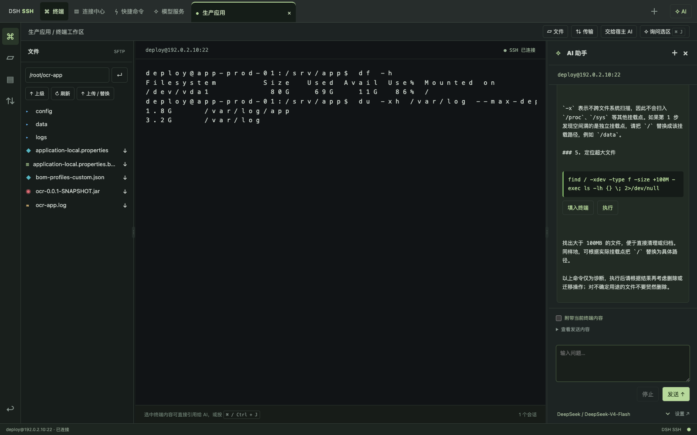

# DSH SSH

DeepSeek Harness 的 SSH／SFTP 工作区插件。安装到现有 Harness，通过侧栏的 **SSH** 打开；顶部 **DSH SSH** 返回 Harness，连接保持到关闭会话、刷新页面或退出 Harness。


**在 Harness 中连接服务器、管理文件，并随时让 AI 协助排查命令问题。**

DSH SSH 是可安装的社区插件，无需另装独立 SSH 客户端。适合日常服务器维护、日志查看和配置修改。AI 使用宿主已配置的模型服务，模型调用费用由对应服务商计算。

| 功能 | 说明 |
| --- | --- |
| 主机管理 | 添加、编辑、删除主机；核对服务器指纹；可选择记住密码 |
| SSH 终端 | 多会话标签、交互式终端、快捷命令 |
| SFTP 文件 | 目录浏览、彩色文件类型、拖放／选择多文件上传、安全替换、下载、UTF-8 文本编辑 |
| 工作区布局 | 文件与终端上下排列，拖动分隔线调整比例 |
| 传输管理 | 手动上传及 AI 直传均显示字节进度、百分比和速度；支持取消与清理记录 |
| AI 助手 | 选中终端内容即可引用解决、分析常见报错、流式回答、停止生成 |
| 命令操作 | AI 单行 Shell 代码块可填入终端，或确认后执行 |

当前稳定版本为 **0.1.0**，正在提交 DSH Market 收录。macOS 已完成实际 SSH 连接验证；Windows 已通过构建与自动测试，尚未完成 SSH 实机验收。

## 实际界面

[](docs/screenshots/workbench-ai.png)

文件区、终端区和 AI／传输区可以左右拖动；打开文件后，文件预览与终端也可以上下拖动。超过 64 KB 的 UTF-8 文本会以只读方式显示，超过 512 KB 时显示文件末尾约 512 KB，并保留完整文件下载入口。

更多界面和逐步操作见 [中文使用教程](docs/GETTING-STARTED.zh-CN.md)。

## 对话操作服务器

在宿主输入框输入 **`@服务器`**，从 Harness 原生候选菜单选择目标，然后直接描述任务，例如“检查 Java 环境并部署这个 jar”或“分析 Nginx 启动失败并修复”。主机以行内引用显示，提交时才序列化为模型可见的 SSH 上下文。宿主 Agent 调用 `dsh_ssh_hosts`、`dsh_ssh_exec`、`dsh_ssh_read`、`dsh_ssh_edit`、`dsh_ssh_upload`，过程和结果显示为 Harness 原生工具卡片。输入 **`/ssh`** 可打开完整 SSH 工作区。若当前 Agent 预设限制了工具，需选择允许这些工具的预设。

命令、日志/文件内容和配置修改以对话卡片展示，命令输出支持运行时查看；执行结果返回给 Agent 继续分析。卡片的 **打开 SSH** / **在 SSH 中打开文件** 会定位到同一主机或文件。卡片在会话历史中保留；运行时输出缓存最多保留 100 条，重启清空。

首次先在工作区核对指纹并连接。已保存密码的主机可由对话按需连接，私钥主机需保留手动连接。远程命令、读取文件及修改服从当前 Harness 会话的访问模式；宿主要求确认时，插件会补充主机信息供核对。每条命令使用独立 Shell，须指定远程目录，不继承手动终端的环境。默认命令超时 60 秒，输出上限 128 KB，超限停止且不自动重试；停止不能保证远程脱离终端的子进程已结束。

配置修改需要先读取文件，提交修改前后内容和版本，经确认后创建同目录备份、检查冲突并原子替换。修改成功不代表服务恢复，需继续运行配置检查及健康检查。备份路径会返回，当前不提供一键回滚。对话中的 JAR、压缩包等工作区文件由 `dsh_ssh_upload` 通过 SFTP 直传服务器，不经过公网临时文件站；工具卡片显示实时字节数、百分比和速度，并返回本地 SHA256。默认拒绝同名文件；用户明确要求替换时，先上传同目录临时文件，完整成功后再原子替换，随后仍应校验并完成健康检查。

手动操作报错后，点击 **交给宿主 AI**，回到对话点击 **加入 SSH 报错上下文**，检查内容后发送。不会覆盖已有草稿或自动发送。右侧独立 AI 面板仍可使用，其历史尚未合并到宿主会话。

## 快速上手

1. 安装到正在使用的 Harness profile，重启宿主，从侧栏打开 **SSH**。
2. 在 **连接中心 → 添加主机** 输入地址、端口、用户名和认证信息，核对指纹后连接。
3. 如需免重复输入，勾选 **记住密码**；已有主机可点 **编辑** 修改并保存。
4. 点 **文件** 打开目录面板并进入目标目录。可把一个或多个本地文件拖到工作区，也可点 **上传 / 替换**；拖入时会显示目标远程目录，同名文件会要求确认并采用临时文件原子替换。点文件名编辑文本，点下载箭头下载文件。
5. 选中终端内容后点击浮出的 **用 AI 解决选中内容**，也可按 **⌘ / Ctrl + J**。选区会自动进入可检查、编辑的上下文。
6. AI 命令代码块下可点 **填入终端** 或 **执行**。执行前确认目标主机，终端应处于空命令提示符。

## 数据与权限

- 主机名称、地址、用户名和指纹同步到宿主 `DSH_HOME/ssh-workbench/hosts.json`，供对话工具与工作区共用；旧版浏览器主机配置在首次打开服务器菜单或工作区时迁移。布局偏好仍在浏览器本地。
- 勾选记住密码后，宿主以 AES-256-GCM 加密存储在 `DSH_HOME/ssh-credentials`。密钥文件与密文位于本机，并以当前用户文件权限保护；这不是系统钥匙串，也不抵御已取得该用户文件访问权限的程序。
- 编辑时密码留空沿用，取消勾选并保存可清除；删除主机同时清除对应密码。私钥和私钥口令不保存。
- 终端输出仅在用户选择附带上下文并发送时交给所选模型服务。报错检测在本地进行，AI 不自动运行命令。
- 删除传输记录不会删除远程文件。关闭 SSH 标签或退出宿主会断开连接。

## 安装

需要 Node.js 22.19+ 或 24+、pnpm、DeepSeek Harness Web。最低兼容／测试基线为官方 `@deepseek-ai/dsh@0.1.2-rc.1`；旧版 `0.1.0-rc.7` 不支持所需接口。先确认或升级 Harness，再安装插件。

如果全局安装了旧版，先运行 `npm install -g @deepseek-ai/dsh@0.1.2-rc.1`。可以从 GitHub Release 下载固定名称的预构建包：

```sh
curl -fL -o dsh-plugin-ssh.tgz https://github.com/techflag/dsh-plugin-ssh/releases/latest/download/dsh-plugin-ssh.tgz
```

在下载目录安装并启动：

```sh
npx @deepseek-ai/dsh@0.1.2-rc.1 plugin --profile web add ./dsh-plugin-ssh.tgz --ignore-scripts
npx @deepseek-ai/dsh@0.1.2-rc.1 web
```

已有 `dsh` 命令时可直接使用 `dsh plugin --profile web add ... --ignore-scripts`。安装进自己的 profile 时，将 `web` 换成该名称，该配置必须包含 Harness Web UI。安装后刷新浏览器。

`--ignore-scripts` 跳过 ssh2 的可选原生加速构建，使用其 JavaScript 实现；不需要 Electron、独立客户端或编译器。首次运行 Harness 本身所需的环境按官方快速开始准备。

卸载：

```sh
dsh plugin --profile web remove dsh-plugin-ssh
```

## 使用

- **连接中心**：添加主机，密码／私钥登录；先核对服务器 SHA256 指纹，再连接。保存主机信息和指纹；可选择在宿主侧加密记住密码，不保存私钥或私钥口令。
- **终端**：多会话标签、交互式 PTY、终端尺寸同步。关闭标签会关闭对应 SSH 连接。
- **文件**：浏览远程目录，多种颜色区分目录、配置、日志、部署包、压缩包与脚本；支持把多个文件拖入当前远程目录，也可通过文件选择器上传；同名文件确认后安全替换，并支持下载及 UTF-8 文本编辑。暂不支持拖动文件夹。
- **传输**：上传进度、取消、结果；下载状态。文本保存采用版本校验和同目录临时文件替换。
- **错误提示**：提交命令后，本地检测常见错误／用法提示，在终端显示「询问 AI」。点击后预填本次输出和问题，按「发送」进行模型分析；不会自动上传终端内容。检测是启发式，不代表已获取命令退出码。
- **AI**：读取 Harness 已配置的模型，支持流式回答和停止。终端选区会显示“用 AI 解决选中内容”，快捷键为 `⌘/Ctrl + J`；发送前可检查、编辑上下文。普通问题默认不附带终端输出，AI 不自动执行命令。回答中的命令使用独立颜色与代码块展示；完整的单行 Shell 代码块支持“填入终端”及确认目标主机后“执行”。执行前应确保终端停在空命令提示符。多行代码及含占位符的示例仅供阅读。
- **模型服务**：返回 Harness 的「设置 → 模型」配置供应商、地址和密钥。插件不另存模型密钥。密钥由宿主统一保存在 `DSH_HOME/.credentials.yaml`，重启或安装 SSH 插件不会清除；设置页显示“已配置”且输入框为空是隐藏密钥的正常状态。模型调用失败时，AI 面板会区分密钥未配置／无效、额度、限流、网络、超时和空响应。
- **快捷命令**：插入当前终端，由用户按 Enter 执行。

## 当前边界

SSH 路由仅接受本机 `http://127.0.0.1:<端口>`，远程访问 Harness 或 `localhost` 地址暂不支持。会话保存在当前页面内，刷新会断开连接。

单文件下载上限 32 MB；64 KB 以内的 UTF-8 文本可编辑，更大的文本可只读预览，超过 512 KB 时显示末尾约 512 KB；最多 12 个并发 SSH 会话。暂不支持跳板机、目录递归传输、断点续传、自动重连、终端分屏、主机分组、语法高亮。文本替换要求服务器支持 OpenSSH 原子 rename；版本检查不等同于远端文件锁。不提供 CPU／延迟监测或可靠的命令退出码识别。

## 开发和构建

克隆本仓库后运行：

```sh
corepack enable
corepack yarn install --immutable
corepack yarn check
corepack yarn pack:plugin
```

产物在 `dist/`，包含 Host 模块、Harness Client 模块、静态工作区和 bundle patch。不会包含 Electron 或 Desktop 包。

实现：Host 使用 `ssh2` + `ws`，通过 `ctx.webServer` 注册路由，`ctx.effect` 清理资源；AI 使用 `ctx.llm`。Client 通过 `dsh.client` 被发现，向 `sidebar.footer.action` 和 `shell.overlay` 添加独立条目。

官方依据：[打包与安装](https://deepseek-harness.github.io/deepseek-harness/develop/basic/publish)、[Client 模块](https://deepseek-harness.github.io/deepseek-harness/reference/subsystems/client-modules)、[Slots](https://deepseek-harness.github.io/deepseek-harness/reference/subsystems/slots)。

安装冒烟测试（使用单独安装的官方 CLI，避免命中旧版全局命令）：

```sh
npm install --prefix /tmp/dsh-official --ignore-scripts @deepseek-ai/dsh@0.1.2-rc.1
node scripts/smoke-install.mjs /tmp/dsh-official/node_modules/@deepseek-ai/dsh/lib/bin.js dist/dsh-plugin-ssh.tgz
```

GitHub Actions 的 `Plugin checks` 工作流在 macOS／Windows 执行构建、类型检查和测试，并在 Linux 验证安装包。工作流通过不等同于 Windows SSH 实机验收。
