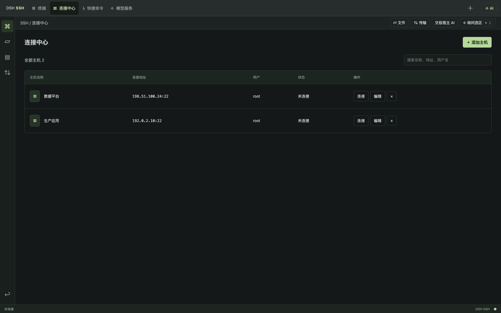
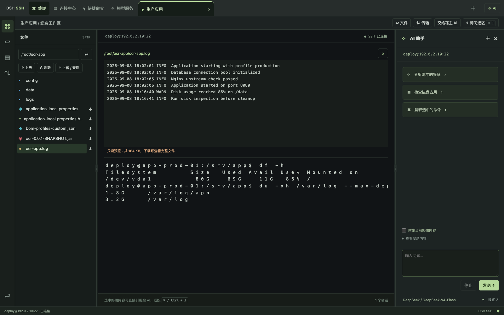

# DSH SSH 使用教程

DSH SSH 安装在 DSH Desktop / DeepSeek Harness 内，使用宿主已经配置的模型。你可以在完整 SSH 工作区手动操作，也可以在 Harness 对话中用 `@服务器` 让 Agent 检查环境、分析错误、修改配置和部署文件。

## 1. 安装

下载 Release 中固定名称的插件包：

```sh
curl -fL -o dsh-plugin-ssh.tgz https://github.com/techflag/dsh-plugin-ssh/releases/latest/download/dsh-plugin-ssh.tgz
```

在 DSH Desktop 的内置终端中安装到当前使用的 profile。下面以 `web` 为例：

```sh
dsh plugin --profile web add ./dsh-plugin-ssh.tgz --ignore-scripts
```

重启 DSH Desktop。侧栏出现 **SSH** 后即安装成功。升级时用新包再次执行相同命令，然后重启。

## 2. 保存并连接主机

1. 打开 **SSH → 连接中心 → 添加主机**。
2. 填写名称、地址、端口、用户名以及密码或私钥。
3. 首次连接先核对服务器 SHA256 指纹。
4. 经常使用密码登录时勾选 **记住密码**。密码由宿主在本机加密保存；私钥及私钥口令不会保存。
5. 已保存的主机可以在连接中心点 **编辑**，连接按钮会直接打开终端。



## 3. 终端、文件和可调布局

进入终端后点 **文件** 打开 SFTP 面板。拖动文件区右边的细分隔线可调整文件区宽度；打开 **AI** 或 **传输** 后，拖动右侧分隔线可调整右侧宽度。双击分隔线恢复默认值，宽度会在本机记住。

点击远程文本文件即可打开预览：

- 64 KB 以内：可编辑，保存时检查远程版本并原子替换。
- 64 KB 以上：只读预览，避免误改大日志。
- 512 KB 以上：显示末尾约 512 KB，并在底部说明文件总大小与截断状态。
- 需要完整内容时点文件右侧的下载箭头。

打开文件后，拖动文件预览和终端之间的横向分隔线可以调整上下高度。



## 4. 上传和替换文件

可以点击 **上传 / 替换** 选择多个文件，也可以直接把文件拖到 SSH 工作区。拖入时会显示目标远程目录。传输管理显示进度、已传字节与结果。

同名文件不会直接截断覆盖。确认替换后，插件先上传为同目录临时文件，完整成功后再原子替换；失败时保留原文件。部署 JAR 后仍应校验 SHA256、备份旧包、重启服务并检查健康状态。

## 5. 让 AI 帮助排错

手动执行命令后，可以选中报错文本，点击 **用 AI 解决选中内容**，或按 `⌘/Ctrl + J`。发送前可以检查和修改要附带的终端上下文。AI 回答中的单行命令支持 **填入终端**；点 **执行** 时会再次显示目标主机并要求确认。

右侧助手适合处理当前 SSH 会话。需要连续完成“检查环境 → 上传包 → 修改配置 → 重启验证”等任务时，点 **交给宿主 AI** 回到 Harness 对话，或者直接在宿主输入框输入 `@服务器` 选择主机后描述任务。输入 `/ssh` 可随时回到完整工作区。


## 6. 常见问题

**安装后看不到 SSH**：确认插件装进 DSH Desktop 当前使用的 profile，并完全重启宿主。

**模型密钥似乎为空**：设置页在已配置时不会回显明文密钥。SSH 插件复用宿主模型，不单独保存或删除模型密钥。

**大文件不能编辑**：这是防止浏览器内误改大日志的保护。仍可预览末尾和下载完整文件；配置文件如确需修改，建议先用 AI 或命令定位需要改动的范围并备份。

**无法安全替换**：服务器需要支持 OpenSSH 原子 rename。插件会保留原文件并报告失败。
